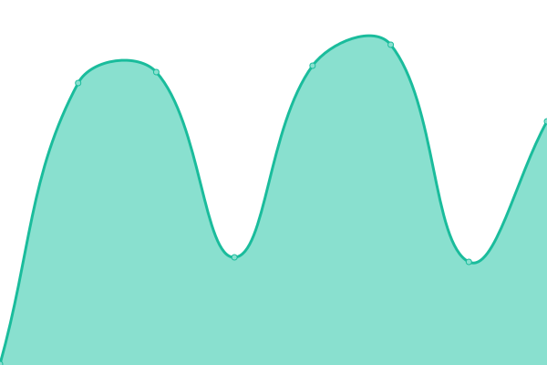
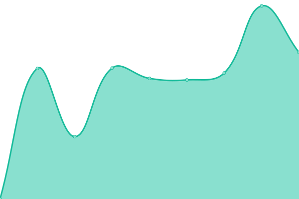
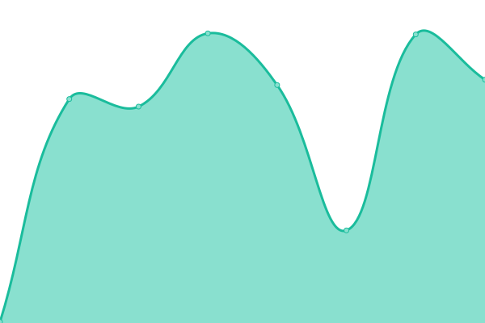

# [📈 Live Status](https://arfoul.github.io/upptime): <!--live status--> **🟩 All systems operational**

This repository contains the open-source uptime monitor and status page for [arfoul](https://arfoul.github.io/upptime), powered by [Upptime](https://github.com/upptime/upptime).

With [Upptime](https://upptime.js.org), you can get your own unlimited and free uptime monitor and status page, powered entirely by a GitHub repository. We use [Issues](https://github.com/arfoul/upptime/issues) as incident reports, [Actions](https://github.com/arfoul/upptime/actions) as uptime monitors, and [Pages](https://arfoul.github.io/upptime) for the status page.

<!--start: status pages-->
<!-- This summary is generated by Upptime (https://github.com/upptime/upptime) -->
<!-- Do not edit this manually, your changes will be overwritten -->
<!-- prettier-ignore -->
| URL | Status | History | Response Time | Uptime |
| --- | ------ | ------- | ------------- | ------ |
|  [nfmiforex.co.uk](https://www.nfmiforex.co.uk) | 🟩 Up | [nfmiforex-co-uk.yml](https://github.com/arfoul/upptime/commits/HEAD/history/nfmiforex-co-uk.yml) | 

 172ms
     
 | 

<a href="https://arfoul.github.io/upptime/history/nfmiforex-co-uk">100.00%</a>
    

|  [clean-spot.gr](https://clean-spot.gr) | 🟩 Up | [clean-spot-gr.yml](https://github.com/arfoul/upptime/commits/HEAD/history/clean-spot-gr.yml) | 

 1192ms
     
 | 

<a href="https://arfoul.github.io/upptime/history/clean-spot-gr">100.00%</a>
    

|  [ianadomi.gr](https://ianadomi.gr) | 🟩 Up | [ianadomi-gr.yml](https://github.com/arfoul/upptime/commits/HEAD/history/ianadomi-gr.yml) | 

 579ms
     
 | 

<a href="https://arfoul.github.io/upptime/history/ianadomi-gr">100.00%</a>
    

|  [periakron.gr](https://periakron.gr) | 🟩 Up | [periakron-gr.yml](https://github.com/arfoul/upptime/commits/HEAD/history/periakron-gr.yml) | 

 1692ms
     
 | 

<a href="https://arfoul.github.io/upptime/history/periakron-gr">100.00%</a>
    

|  [kolan4u.gr](https://kolan4u.gr) | 🟩 Up | [kolan4u-gr.yml](https://github.com/arfoul/upptime/commits/HEAD/history/kolan4u-gr.yml) | 

 1400ms
     
 | 

<a href="https://arfoul.github.io/upptime/history/kolan4u-gr">100.00%</a>
    

<!--end: status pages-->

[**Visit our status website →**](https://arfoul.github.io/upptime)

## 📄 License

- Powered by: [Upptime](https://github.com/upptime/upptime)
- Code: [MIT](./LICENSE) © [Anand Chowdhary](https://anandchowdhary.com), supported by [Pabio](https://pabio.com)
- Data in the `./history` directory: [Open Database License](https://opendatacommons.org/licenses/odbl/1-0/)
